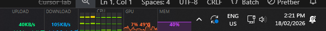

# mikes-windows-tools

Personal Windows productivity scripts and CLI tools, tracked in git so changes
are versioned and the setup can be reproduced on any machine.

---

## Quick start (fresh machine)

```powershell
git clone <repo-url> C:\dev\me\mikes-windows-tools
cd C:\dev\me\mikes-windows-tools
powershell -ExecutionPolicy Bypass -File install.ps1
```

Then make sure `C:\dev\tools` is on your `PATH` (it should already be).

---

## How it works

```
C:\dev\me\mikes-windows-tools\   ← this repo (source of truth)
    install.ps1
    transcribe\
        transcribe.bat            ← real logic lives here
    scale-monitor4\
        scale-monitor4.ps1
        scale-monitor4.vbs
        scale-monitor4.bat
    ...

C:\dev\tools\                    ← on PATH; kept clean
    transcribe.bat               ← thin stub: sets EXEDIR, calls repo bat
    removebg.bat                 ← thin stub
    backup-phone.bat             ← thin stub
    all-hands.bat                ← thin stub
    Scale Monitor 4.lnk         ← taskbar shortcut → repo .vbs
    ffmpeg.exe                   ← large binaries stay here, not in repo
    faster-whisper-xxl.exe
    ...
```

`install.ps1` generates the stubs. The stubs point at absolute paths inside
the repo, so a `git pull` is all you ever need to pick up changes to any tool.
Re-run `install.ps1` only when **adding a new tool**.

---

## Updating a tool

```powershell
# 1. Edit the source file in the repo (e.g. scale-monitor4\scale-monitor4.ps1)
# 2. Test it
# 3. Commit
cd C:\dev\me\mikes-windows-tools
git add .
git commit -m "scale-monitor4: describe the change"
```

No reinstall needed. The stub in `C:\dev\tools` already points at the repo file.

---

## Adding a new tool

### CLI tool (runs from terminal)

1. Create a subfolder: `mkdir my-tool`
2. Write the logic — a `.bat`, `.ps1`, or `.vbs` as appropriate
3. Add a stub entry in `install.ps1` using the `Write-BatStub` helper
4. Run `install.ps1` once
5. Commit everything

Stub pattern for a plain bat tool:

```powershell
Write-BatStub "my-tool" @"
@echo off
call "$RepoDir\my-tool\my-tool.bat" %*
"@
```

Stub pattern when the tool needs the `C:\dev\tools` exe directory (like `transcribe`):

```powershell
Write-BatStub "my-tool" @"
@echo off
set "EXEDIR=%~dp0"
call "$RepoDir\my-tool\my-tool.bat" %*
"@
```

Then in `my-tool.bat` use `%EXEDIR%` instead of `%~dp0` to find co-located binaries.

### Taskbar / GUI tool (like scale-monitor4)

1. Create a subfolder with the `.ps1` and a `.vbs` launcher:

   **`my-tool.vbs`** (boilerplate — copy from `scale-monitor4\scale-monitor4.vbs`):
   ```vbs
   Set objShell = CreateObject("WScript.Shell")
   objShell.Run "powershell.exe -NoProfile -WindowStyle Hidden -ExecutionPolicy Bypass -File """ & _
       CreateObject("Scripting.FileSystemObject").GetParentFolderName(WScript.ScriptFullName) & _
       "\my-tool.ps1""", 0, False
   ```

2. Add a shortcut entry in `install.ps1`:

   ```powershell
   $vbsPath      = "$RepoDir\my-tool\my-tool.vbs"
   $shortcutPath = Join-Path $ToolsDir "My Tool.lnk"
   $wsh = New-Object -ComObject WScript.Shell
   $sc  = $wsh.CreateShortcut($shortcutPath)
   $sc.TargetPath       = "wscript.exe"
   $sc.Arguments        = "`"$vbsPath`""
   $sc.WorkingDirectory = "$RepoDir\my-tool"
   $sc.Description      = "What this tool does"
   $sc.IconLocation     = "%SystemRoot%\System32\imageres.dll,109"
   $sc.Save()
   ```

3. Run `install.ps1`, then right-click the `.lnk` in `C:\dev\tools` → **Pin to taskbar**.

---

## Tools reference

| Name | Type | What it does |
|---|---|---|
| `transcribe <video> [--cpu]` | CLI | Extracts audio and transcribes via faster-whisper (CUDA with CPU fallback) |
| `removebg <image>` | CLI | Removes image background using rembg / birefnet-portrait |
| `backup-phone` | CLI | Backs up Android phone over ADB |
| `all-hands` | CLI | Launches OpenHands AI coding agent via Docker |
| Scale Monitor 4 | Taskbar | Toggles Monitor 4 (HG584T05) between 200% (normal) and 300% (filming) |
| Task Monitor | Taskbar | Real-time NET/CPU/GPU/MEM sparklines overlaid on the taskbar |

---

## taskmon — taskbar system monitor




Displays live performance stats as sparkline graphs on the right side of the
Windows taskbar, sitting just to the left of the system clock.

**Panels:** UPLOAD · DOWNLOAD · CPU · GPU (util % + temp °C) · MEM %

**Features:**
- Transparent background — graphs float on the taskbar, no dark box
- Per-core XMeters-style CPU grid (toggle in Settings) or aggregate sparkline
- GPU monitoring via NVML — no `nvidia-smi` subprocess, <0.1% CPU overhead
- Customisable colours, update interval, and opacity via right-click → Settings
- Settings saved to `%LOCALAPPDATA%\taskmon\settings.json`

**Dev workflow** (all from `taskmon\`):

```bat
build-and-run.bat   # kill existing + compile + launch  (use this after every change)
kill.bat            # just kill the running instance
build.bat           # kill + compile only (no launch)
```

Compiled output goes to `%LOCALAPPDATA%\taskmon\taskmon.dll` (not in git).
First build takes ~5 seconds; subsequent builds are the same (no incremental cache).

**To pin to taskbar:** run `install.ps1` once, then right-click
`C:\dev\tools\Task Monitor.lnk` → Pin to taskbar.

**Known issue:** a 1–2 frame flicker when switching maximized apps. See
[`taskmon/FLICKER-RESEARCH.md`](taskmon/FLICKER-RESEARCH.md) for investigation
notes and potential fixes.

---

## Notes

- Large binaries (`ffmpeg.exe`, `faster-whisper-xxl.exe`, `_models\`, etc.) live in
  `C:\dev\tools` and are **not** tracked here — too big for git.
- The `transcribe` stub injects `EXEDIR=C:\dev\tools` so the bat finds those binaries
  even though the logic now lives in this repo.
- If you move the repo, just run `install.ps1` again to regenerate the stubs with
  the new absolute path.
