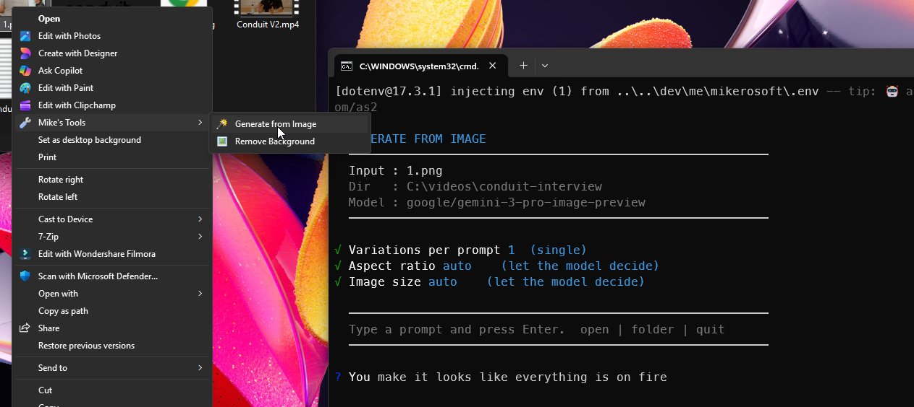

#  generate-from-image



Interactive CLI tool for AI image generation. Right-click any image in Explorer, describe what you want, and Gemini 3 Pro generates a new image based on your input image and prompt. Each generation is saved as a numbered file alongside the original.

## Usage

**From File Explorer:**
Right-click any image file, choose **Mike's Tools > Generate from Image**.
(On Windows 11, click "Show more options" first.)

**From the terminal:**

```
generate-from-image <image_file>
```

On launch the tool:

1. Displays the input image name and output directory.
2. Drops into an interactive prompt loop.
3. Each message generates a new image saved as `<originalname>-generated-001.png`, `002.png`, etc.
4. Type `open` to open the last generated image in your default viewer.
5. Type `folder` to open the output directory in Explorer.
6. Type `quit` to exit.

## Commands

| Input              | Action                                                           |
| ------------------ | ---------------------------------------------------------------- |
| any text           | Generate a new image based on the prompt                         |
| `open`             | Open the last generated image in the default viewer             |
| `folder`           | Open the output folder in Explorer                              |
| `settings`         | Show current generation settings                                |
| `n <1-4>`          | Set number of variations per prompt (default: 1)                |
| `aspect <ratio>`   | Set aspect ratio: `1:1` `16:9` `9:16` `4:3` `3:2` `21:9` etc.  |
| `size <1K\|2K\|4K>` | Set output resolution (default: `1K`)                           |
| `quit`             | Exit                                                             |

Settings persist for the whole session. Variations run sequentially and each is saved as a separate numbered file.

## Dependencies

| Requirement          | Notes                                                                    |
| -------------------- | ------------------------------------------------------------------------ |
| `OPENROUTER_API_KEY` | Set in `.env` at the repo root. Get a key at https://openrouter.ai/keys  |
| `bun`                | Install via `winget install oven-sh.bun` or https://bun.sh               |
| `@inquirer/prompts`  | Installed automatically by `deps.ps1` or `bun install`                  |

## Model

Uses `google/gemini-3-pro-image-preview` via the OpenRouter API.
To change the model, edit the `MODEL` constant at the top of `generate-from-image.ts`.
