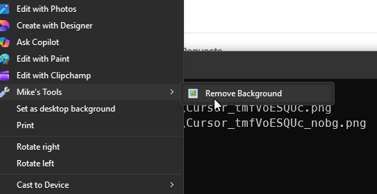

#  removebg

Removes the background from an image using [rembg](https://github.com/danielgatis/rembg) with the `birefnet-portrait` model.

## Usage

**From the terminal:**
```
removebg <image_file>
```

**From File Explorer:**
Right-click any image file, then choose **Mike's Tools > Remove Background**.
(On Windows 11, click "Show more options" first to get the classic menu.)
`install.ps1` registers this for `.jpg`, `.jpeg`, `.png`, `.webp`, `.bmp`, `.tiff`.

Output is saved alongside the input with `_nobg` appended to the filename (e.g. `photo_nobg.jpg`).

## Dependencies

Python package: `rembg[gpu]` (installed by `deps.ps1`; falls back to CPU-only `rembg` if GPU install fails).

## Notes

- Uses the `birefnet-portrait` model, which is well-suited for photos of people.
- The model weights are downloaded automatically on first run (~1 GB).
