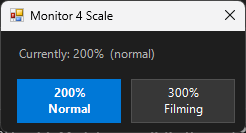

 

# scale-monitor

Toggles the DPI scaling of Monitor 4 (HG584T05) between 200% (normal use) and 300% (filming).

## Usage

Click the taskbar shortcut, or run directly:

```powershell
wscript.exe "C:\dev\me\mikerosoft.app\tools\scale-monitor\scale-monitor.vbs"
```

A small popup appears near the bottom-right of the screen showing the current scale. Click **200%** or **300%** to switch. The change applies immediately — no reboot or sign-out needed.

## How it works

Sets `DpiValue` in the per-monitor registry key for this display, then broadcasts `WM_SETTINGCHANGE` and calls `ChangeDisplaySettingsEx` with `CDS_RESET` to apply the new DPI live.

| DpiValue | Scale             |
| -------- | ----------------- |
| 4        | 200% — normal use |
| 7        | 300% — filming    |

## Notes

- Specific to Monitor 4 on this machine (registry key is hardcoded).
- If the registry key is not found, a message box warns that Monitor 4 may not be connected.
