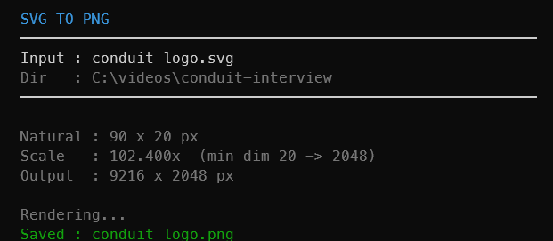

#  svg-to-png

Renders an SVG file to PNG, scaling it up so the smallest dimension is at least 2048px. If the SVG is already 2048px or larger on its shortest side, it renders at natural size.


## Screenshots




## Usage

**From File Explorer:**
Right-click any `.svg` file, choose **Mike's Tools > Render to PNG (2048px min)**.
(On Windows 11, click "Show more options" first.)

**From the terminal:**

```
svg-to-png <file.svg>
```

The PNG is saved alongside the original SVG with the same name, e.g. `logo.svg` -> `logo.png`.

## Scaling behaviour

| SVG natural size | Min dim | Scale | Output size |
| ---------------- | ------- | ----- | ----------- |
| 100 x 100        | 100     | 20.48x | 2048 x 2048 |
| 100 x 200        | 100     | 20.48x | 2048 x 4096 |
| 800 x 600        | 600     | 3.41x  | 2731 x 2048 |
| 3000 x 4000      | 3000    | 1x     | 3000 x 4000 |

## Dependencies

| Requirement      | Notes                                                          |
| ---------------- | -------------------------------------------------------------- |
| `bun`            | Install via `winget install oven-sh.bun` or https://bun.sh    |
| `@resvg/resvg-js`| Installed automatically by `deps.ps1` or `bun install`        |