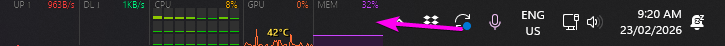

# task-stats

A lightweight system-stats overlay that sits on the right side of the Windows taskbar, just to the left of the system clock. Displays NET↑/↓, CPU, GPU, and RAM as live sparkline graphs - a replacement for TrafficMonitor / XMeters.

## Usage

```
task-stats          # launch (or click the taskbar shortcut)
```

Right-click the overlay for settings, display options, and exit.

## Dev workflow

```bat
cd task-stats
build-and-run.bat   # kill old instance + compile + launch
```

After editing any `.cs` file, just re-run `build-and-run.bat`.

## Architecture

- Built with MSBuild against .NET Framework 4 - no .NET SDK required.
- Compiled to `%LOCALAPPDATA%\task-stats\task-stats.dll`; `task-stats.ps1` loads the DLL and calls `App::Run()`.
- `task-stats.vbs` is the silent launcher (no console window flash).

| File | Purpose |
|---|---|
| `task-stats.csproj` | MSBuild project |
| `Native.cs` | Win32 P/Invoke + NVML declarations |
| `Settings.cs` | JSON-backed settings (`%LOCALAPPDATA%\task-stats\settings.json`) |
| `Metrics.cs` | Circular buffer + PerformanceCounter/NVML sampling |
| `OverlayForm.cs` | Layered window, rendering, hit-test, right-click menu |
| `SettingsForm.cs` | Tabbed settings dialog |
| `App.cs` | DarkRenderer + entry point |
| `icons\` | famfamfam silk icons (CC BY 2.5) embedded as manifest resources |
| `build.bat` | Compile only |
| `build-and-run.bat` | Kill + compile + launch |
| `kill.bat` | Kill running instance |

## Dependencies

`nvml.dll` (ships with NVIDIA drivers, expected at `C:\Windows\System32\nvml.dll`). Checked by `deps.ps1`.

## Known limitations

- Brief 1–2 frame flicker when switching between maximised apps (separate compositor surface from the taskbar). See `FLICKER-RESEARCH.md` for investigation notes.
- In exclusive-fullscreen mode the overlay may briefly disappear and return within ~100 ms.
