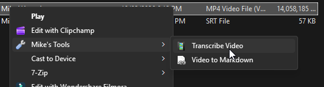

#  transcribe

Transcribes a video file to text using [faster-whisper-xxl](https://github.com/Purfview/whisper-standalone-win). Extracts audio with ffmpeg, runs Whisper, and saves the transcript as an `.srt` file next to the input.

## Usage

**From the terminal:**
```
transcribe <video_file> [--cpu]
```

**From File Explorer:**
Right-click any video file, then choose **Mike's Tools > Transcribe Video**.
(On Windows 11, click "Show more options" first to get the classic menu.)
`install.ps1` registers this for `.mp4`, `.mkv`, `.avi`, `.mov`, `.wmv`, `.webm`, and other common video formats.

| Argument | Description |
|---|---|
| `<video_file>` | Path to the video (or audio) file to transcribe |
| `--cpu` | Force CPU inference (default is CUDA; falls back to CPU automatically if CUDA fails) |

The transcript is saved as `<input_basename>.srt` in the same folder as the input file.

## Screenshots



## Dependencies

Large binaries that must be downloaded manually and placed in `C:\dev\tools`:

| File | Download |
|---|---|
| `ffmpeg.exe` | https://ffmpeg.org/download.html |
| `faster-whisper-xxl.exe` | https://github.com/Purfview/whisper-standalone-win/releases |
| `_models\` | Whisper model files (downloaded by faster-whisper-xxl on first run) |

Run `deps.ps1` (or `install.ps1`) to check whether these are in place.

## Notes

- Uses `float16` compute type when running on CUDA.
- Audio is extracted to a temp `.wav` file and cleaned up after transcription.
