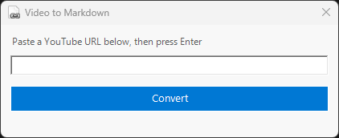
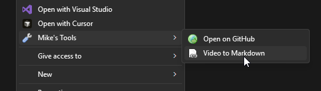

 

# vid2md

Convert a YouTube URL into a ready-to-paste markdown image link and copy it to your clipboard in seconds.

Uses the [video-to-markdown.com](https://video-to-markdown.com) public API. Videos are processed and cached server-side, so repeated calls for the same URL are instant.

---

## What it produces

Given a YouTube URL, vid2md calls the API and puts something like this on your clipboard:

```markdown
[](https://youtu.be/dQw4w9WgXcQ)
```

Paste it into any Markdown file and you get a clickable thumbnail that links back to the video.

---

## Usage

### Right-click menu (any file or folder)

Right-click **anything** in Explorer - any file type, any folder - open **Mike's Tools** and choose **Video to Markdown**. A small window appears in the centre of the screen:

1. Paste the YouTube URL (pre-filled automatically if your clipboard already has one)
2. Press **Enter** or click **Convert**
3. A progress bar animates while the API runs
4. On success: "Copied to clipboard!" appears, a Windows toast notification pops, and the window closes automatically after 1.5 seconds

### Right-click a `.url` Internet Shortcut (silent mode)

If you have a YouTube link saved as a Windows Internet Shortcut (`.url` file), right-clicking and choosing **Video to Markdown** converts it with no UI at all - the toast notification is the only feedback.

### Command line

```
vid2md                          # open the UI (clipboard pre-filled if YouTube URL is there)
vid2md https://youtu.be/...     # silent - no UI, just clipboard + toast
vid2md "My Video.url"           # silent - reads URL from the shortcut file
```

---

## Workflow tip

Copy the YouTube URL from your browser before opening the tool - the text box is pre-filled so you just hit Enter.

---

## Icon

`page_white_link.png` from the [famfamfam silk icon set](https://www.famfamfam.com/lab/icons/silk/) (Mark James, CC BY 2.5).

---

## Dependencies

None. Uses built-in PowerShell (`Invoke-RestMethod`, `Set-Clipboard`) and Windows Runtime toast notifications (Windows 10+). Requires an internet connection.

---

## API

`POST https://quirky-squirrel-220.convex.site/api/markdown`

Request:
```json
{ "url": "https://youtu.be/dQw4w9WgXcQ" }
```

Response:
```json
{
  "markdown": "[](https://youtu.be/...)",
  "title": "Video Title",
  "url": "https://youtu.be/..."
}
```

Built on [Convex](https://convex.dev). Thumbnails hosted on Cloudflare R2 at `thumbs.video-to-markdown.com`.
