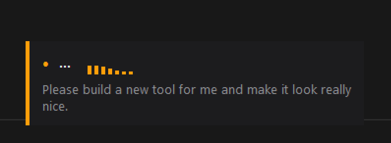

# voice-type

Push-to-talk voice transcription that types directly into any focused window.
Hold **Right Ctrl** while speaking, release to paste. Runs entirely locally —
no cloud, no subscription.

[](https://youtu.be/lYjgJ8KIh-Y)

---

## Quick start

```powershell
# First time: install dependencies
powershell -ExecutionPolicy Bypass -File .\tools\voice-type\deps.ps1

# Add to taskbar (run install.ps1 from repo root if not already done)
powershell -ExecutionPolicy Bypass -File .\install.ps1

# Or launch manually for testing
wscript.exe "C:\dev\me\mikerosoft.app\tools\voice-type\voice-type.vbs"
```

Right-click `C:\dev\tools\Voice Type.lnk` → **Pin to taskbar** for one-click launch.

---

## Usage

| Action                    | What happens                                                                     |
| ------------------------- | -------------------------------------------------------------------------------- |
| Hold **Right Ctrl**       | Recording starts — animated overlay appears at the bottom-centre of your monitor |
| Keep holding              | Waveform bars respond to your voice; partial transcription builds up below them  |
| Release **Right Ctrl**    | Final transcription runs and text is pasted into the active window               |
| Right-click **tray icon** | Settings menu (see below)                                                        |

The text is injected into whatever window had focus when you released the key —
text editors, browsers, chat apps, terminals, etc. Your clipboard is left untouched.

---

## Overlay

While recording a pill-shaped overlay appears at the **bottom-centre of the
monitor containing the focused window**:

```
┌─┬──────────────────────────────────────┐
│ │  ● REC  ▂▄█▇▄▆▂                    │
│ │  "partial transcript text..."       │
└─┴──────────────────────────────────────┘
```

| Element                      | Description                                           |
| ---------------------------- | ----------------------------------------------------- |
| Coloured accent strip (left) | Red = recording, amber = transcribing                 |
| `● REC` / `...` label        | Current state                                         |
| Waveform bars                | 7 bars that animate to your mic level in real time    |
| Partial text                 | Streaming preview — updates ~every 0.5 s as you speak |

The overlay uses `WS_EX_NOACTIVATE` so it **never steals keyboard focus**.

---

## System tray icon

A microphone icon sits in the system tray. Its colour reflects the current state:

| Colour    | State                  |
| --------- | ---------------------- |
| Dark grey | Idle — ready to record |
| Red       | Recording              |
| Amber     | Transcribing           |
| Very dark | Disabled               |

**Right-click menu:**

| Item               | Description                                              |
| ------------------ | -------------------------------------------------------- |
| **Enabled** ✓      | Toggle the tool on/off without killing the process       |
| **Open Log**       | Opens `voice-type.log` in Notepad                        |
| **Run on Startup** | Add/remove from `HKCU\...\Run` (auto-start with Windows) |
| **Exit**           | Quit cleanly                                             |

---

## How it works

- **Hotkey polling** — `GetAsyncKeyState(VK_RCONTROL)` at 100 Hz. No global
  keyboard hook is installed, so `Ctrl+C`, `Ctrl+V`, etc. are never affected.
- **Audio capture** — `sounddevice` streams 16 kHz mono float32 from the
  default microphone into a NumPy buffer.
- **Streaming preview** — while the key is held, a background thread uses
  `tiny.en` to transcribe accumulated audio every 0.5 s and updates the
  overlay. This model is loaded as a separate instance so it never blocks
  the final transcription.
- **Final transcription** — on key release, `small.en` (or `large-v3-turbo`
  on CUDA) transcribes all recorded audio for accuracy. Result is injected
  directly into the focused window via `SendInput` with `KEYEVENTF_UNICODE`
  flags — the clipboard is never touched.
- **Two-model design** — `tiny.en` (~75 MB, ~0.1 s/pass) for live preview;
  `small.en` (~244 MB, ~0.5–1.5 s) for final. No lock contention, so the
  streaming never delays the paste.
- **Monitor detection** — `MonitorFromWindow` + `GetMonitorInfoW` find the
  work area of the monitor containing the focused window. The overlay is
  centred at its bottom edge.
- **Waveform animation** — the overlay canvas polls `Recorder.get_rms()` at
  30 fps, driving 7 bottom-anchored bars with a smoothed exponential moving
  average. A sine-sweep animation plays during transcription.
- **Log rotation** — on startup, if `voice-type.log` exceeds 1 MB the file
  is trimmed to the last 200 lines automatically.

---

## Performance

| Hardware          | Final model      | Typical post-release delay          |
| ----------------- | ---------------- | ----------------------------------- |
| CPU (any)         | `small.en`       | ~0.5–1.5 s depending on clip length |
| NVIDIA GPU (CUDA) | `large-v3-turbo` | ~0.2 s                              |

CUDA is auto-detected at startup (`ctranslate2.get_cuda_device_count()` +
`cublas64_12.dll` load check). Falls back to CPU automatically.

Both models download once from HuggingFace on first use and are cached in
`%USERPROFILE%\.cache\huggingface\`.

---

## Configuration

Edit the constants near the top of `voice-type.py`:

| Constant          | Default            | Description                                   |
| ----------------- | ------------------ | --------------------------------------------- |
| `HOTKEY_VK`       | `0xA3`             | Virtual key for push-to-talk (Right Ctrl)     |
| `CPU_MODEL`       | `"small.en"`       | Final transcription model on CPU              |
| `GPU_MODEL`       | `"large-v3-turbo"` | Final transcription model on CUDA             |
| `STREAM_MODEL`    | `"tiny.en"`        | Preview model (always CPU, separate instance) |
| `STREAM_INTERVAL` | `0.5`              | Seconds between streaming preview passes      |
| `DEVICE`          | `None`             | Mic device (`None` = system default)          |

**Common hotkey alternatives:**

| VK code | Key         |
| ------- | ----------- |
| `0xA5`  | Right Alt   |
| `0x14`  | Caps Lock   |
| `0x91`  | Scroll Lock |
| `0x7B`  | F12         |

---

## Dependencies

Installed automatically by `deps.ps1`:

```
faster-whisper   speech-to-text engine (CTranslate2 backend)
sounddevice      microphone capture
numpy            audio buffer maths
Pillow           tray icon drawing
pystray          system tray integration
```

---

## Files

| File             | Purpose                                        |
| ---------------- | ---------------------------------------------- |
| `voice-type.py`  | Main script — all logic                        |
| `voice-type.vbs` | Silent launcher (no console window)            |
| `voice-type.ps1` | PowerShell launcher called by the VBS          |
| `deps.ps1`       | Installs Python dependencies                   |
| `voice-type.log` | Runtime log (gitignored, auto-rotates at 1 MB) |
